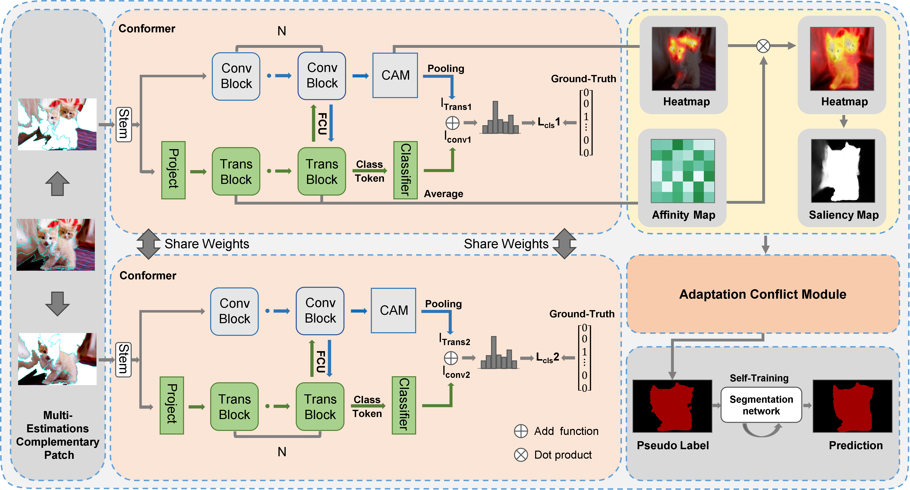

# MECPformer
Official Implementation of the paper: [MECPformer: Multi-estimations Complementary Patch with CNN-Transformers for Weakly Supervised Semantic Segmentation](https://arxiv.org/pdf/2303.10689.pdf).

Accepted to Neural Computing and Applications.

<p align="left"></p>

## Abstract
The initial seed based on the convolutional neural network (CNN) for weakly supervised semantic segmentation always highlights the most
discriminative regions but fails to identify the global target information. Methods based on transformers have been proposed successively
benefiting from the advantage of capturing long-range feature representations. However, we observe a flaw regardless of the gifts based on
the transformer. Given a class, the initial seeds generated based on the transformer may invade regions belonging to other classes. Inspired
by the mentioned issues, we devise a simple yet effective method with Multi-estimations Complementary Patch (MECP) strategy and Adaptive
Conflict Module (ACM), dubbed MECPformer. Given an image, we manipulate it with the MECP strategy at different epochs, and the network mines and deeply fuses the semantic information at different levels. In addition, ACM adaptively removes conflicting pixels and exploits the network self-training capability to mine potential target information. Without bells and whistles, our MECPformer has reached new state-of-the-art 72.0% mIoU on the PASCAL VOC 2012 and 42.4% on MS COCO 2014 dataset. 

## Prerequisite

#### 1. install dependencies 
Ubuntu 20.04, with Python 3.6 and the following python dependencies.

```pip install -r requirements.txt```

#### 2. Download dataset 
Download [the PASCAL VOC 2012 development kit](http://host.robots.ox.ac.uk/pascal/VOC/voc2012).

#### 3. Download pretrained weights
Download [Conformer-S pretrained weights](https://drive.google.com/file/d/1qjLDy8MYU_TV2hspyYNCXeWrWho360qa/view?usp=share_link).

#### 4. Download saliency map
Download [saliency map](https://drive.google.com/file/d/1n7hVi8U2ylBMjz_bECsl_wSAmlRqnVr8/view?usp=share_link).

## Usage

#### 1. Run the run.sh script for training MECPformer in the initial seeds stage

```bash run.sh```

#### 2. Train semantic segmentation network
To train DeepLab-v2, we refer to [deeplab-pytorch](https://github.com/kazuto1011/deeplab-pytorch).

## Testing

#### Download our trained weights
| Stage       | Backbone   | Google drive | mIoU (%) |
|--------------|------------|--------------|--------------|
| Initial seeds | Conformer-S | [Weights](https://drive.google.com/file/d/1pYWyNjPTLVrZ5nlvipmgjRa_bDP6qSRE/view?usp=share_link)  | 66.6 |
| Final predict | ResNet101 | [Weights](https://drive.google.com/file/d/1thFitdq1MYq_BWKmNIlKZp1BCQzZFJQi/view?usp=share_link)  | 72.0 |

## Acknowledgements
This code is borrowed from [TransCAM](https://github.com/liruiwen/TransCAM), [CPN](https://github.com/Ferenas/CPN), and [deeplab-pytorch](https://github.com/kazuto1011/deeplab-pytorch).

## Citing MECPformer

If you use MECPformer in your research, please use the follwing entry:

'''

@article{liu2023mecpformer,
  title={MECPformer: Multi-estimations Complementary Patch with CNN-Transformers for Weakly Supervised Semantic Segmentation},
  author={Liu, Chunmeng and Li, Guangyao and Shen, Yao and Wang, Ruiqi},
  journal={Neural Comput & Applic},
  year={2023}
}

'''

or

'''

Liu, C., Li, G., Shen, Y. et al. MECPformer: multi-estimations complementary patch with CNN-transformers for weakly supervised semantic segmentation. Neural Comput & Applic 35, 23249–23264 (2023). https://doi.org/10.1007/s00521-023-08816-2

'''

